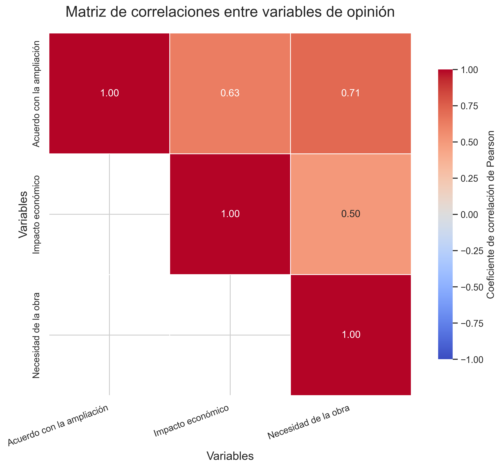

# Informe de resultados - Proyecto de Estadística

## 1. Descripción general de la muestra

- Tamaño de la muestra: 120 encuestados.
- Variables de interés:
  - Grado de acuerdo con la ampliación (1–10)
  - Percepción de impacto en la economía (1–10)
  - Percepción de necesidad de la obra (1–10)
  - Factores: frecuencia de viaje y grupo etario.

## 2. Análisis descriptivo

### 2.1. Grado de acuerdo con la ampliación

- n = 120
- Media = 8.76
- Mediana = 10.00
- Moda = 10.00
- Desviación estándar = 1.94
- Cuartiles: Q1 = 8.00, Q2 = 10.00, Q3 = 10.00

### 2.2. Impacto en la economía

- n = 120
- Media = 8.20
- Mediana = 9.00
- Moda = 10.00
- Desviación estándar = 2.17
- Cuartiles: Q1 = 7.00, Q2 = 9.00, Q3 = 10.00

### 2.3. Percepción de necesidad

- n = 120
- Media = 8.03
- Mediana = 8.00
- Moda = 10.00
- Desviación estándar = 2.17
- Cuartiles: Q1 = 7.00, Q2 = 8.00, Q3 = 10.00

## 3. Intervalos de confianza

### 3.1. Media del grado de acuerdo con la ampliación

- n = 120
- Media = 8.76
- IC 95%: [8.41, 9.11]

Con un 95 % de confianza, el verdadero promedio poblacional de acuerdo con la ampliación del aeropuerto se encuentra entre 8.41 y 9.11.

### 3.2. Proporción de personas a favor de la ampliación

- Definición de "a favor": calificación ≥ 6.
- n = 120
- Proporción muestral = 0.92
- IC 95%: [0.87, 0.97]

Con un 95 % de confianza, la proporción real de personas a favor de la ampliación se ubica entre 0.87 y 0.97.

## 4. Prueba de hipótesis principal

- Hipótesis:
  - H0: μ ≤ 5.00
  - H1: μ > 5.00
- Estadístico t = 21.17
- p-valor (cola derecha) = 0.0000
- Conclusión: Se rechaza la hipótesis nula y se concluye que la media poblacional supera a 5.00.

## 5. ANOVA factorial 2×3 (Frecuencia de viaje × Grupo etario)

```
                                       sum_sq     df         F    PR(>F)
C(frecuencia_viaje)                  6.037953    1.0  1.795564  0.182914
C(grupo_edad)                        2.157997    2.0  0.320872  0.726169
C(frecuencia_viaje):C(grupo_edad)   56.415725    2.0  8.388443  0.000399
Residual                           383.348406  114.0       NaN       NaN
```

Modelo ANOVA ajustado correctamente.

Interpretación: No se encontró evidencia significativa para el efecto principal de la frecuencia de viaje (p = 0.183). No se encontró evidencia significativa para el efecto principal del grupo etario (p = 0.726). Se encontró evidencia de que la interacción entre frecuencia de viaje y grupo etario es significativa (p = 0.000).

## 6. Gráficas




## 7. Conclusiones generales

- El grado de acuerdo con la ampliación presenta una media de 8.76, lo que sugiere una valoración favorable.
- Las percepciones sobre el impacto económico (8.20) y la necesidad de la obra (8.03) también muestran niveles altos en la escala de 1 a 10.
- La prueba t con hipótesis H0: μ ≤ 5.00 arroja p = 0.0000, lo que respalda la afirmación de que la media supera el umbral..
- No se encontró evidencia significativa para el efecto principal de la frecuencia de viaje (p = 0.183). No se encontró evidencia significativa para el efecto principal del grupo etario (p = 0.726). Se encontró evidencia de que la interacción entre frecuencia de viaje y grupo etario es significativa (p = 0.000).

## 8. Pruebas de normalidad

### 8.1. Variable de acuerdo con la ampliación

- n = 120
- Estadístico Shapiro-Wilk = 0.69
- p-valor = 0.0000
- Interpretación: Se rechaza la normalidad (p < 0.050).

### 8.2. Residuos del modelo ANOVA

- n = 120
- Estadístico Shapiro-Wilk = 0.82
- p-valor = 0.0000
- Interpretación: Se rechaza la normalidad (p < 0.050).

## 9. Correlación entre variables de opinión

Se observa la matriz de correlaciones en la figura correspondiente. A continuación se describen los coeficientes más relevantes:
- La correlación entre acuerdo con la ampliación y el impacto económico es 0.63, considerada alta (positiva).
- La correlación entre acuerdo con la ampliación y la percepción de necesidad es 0.71, considerada alta (positiva).
- La correlación entre impacto económico y necesidad de la obra es 0.50, considerada moderada (positiva).

## 10. Recomendaciones

Con una media de acuerdo de 8.76 y una proporción estimada a favor de 91.7%, la ampliación cuenta con amplia aceptación social. Se recomienda comunicar los beneficios económicos y la necesidad de la obra resaltando que La prueba t rechaza la hipótesis nula y respalda que la media supera el umbral establecido. La interacción significativa entre edad y frecuencia de viaje sugiere segmentar las comunicaciones según ambos factores.
