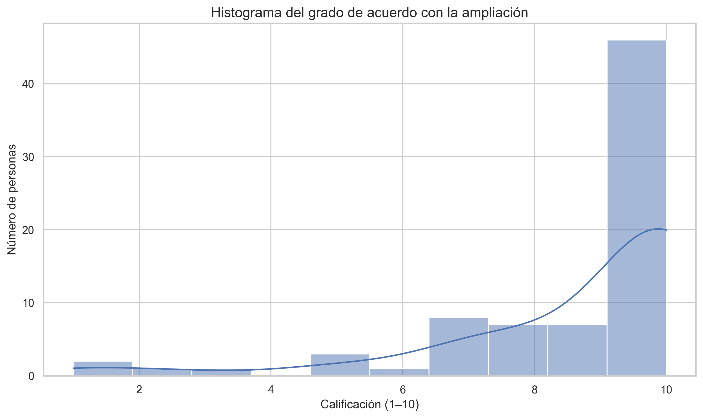
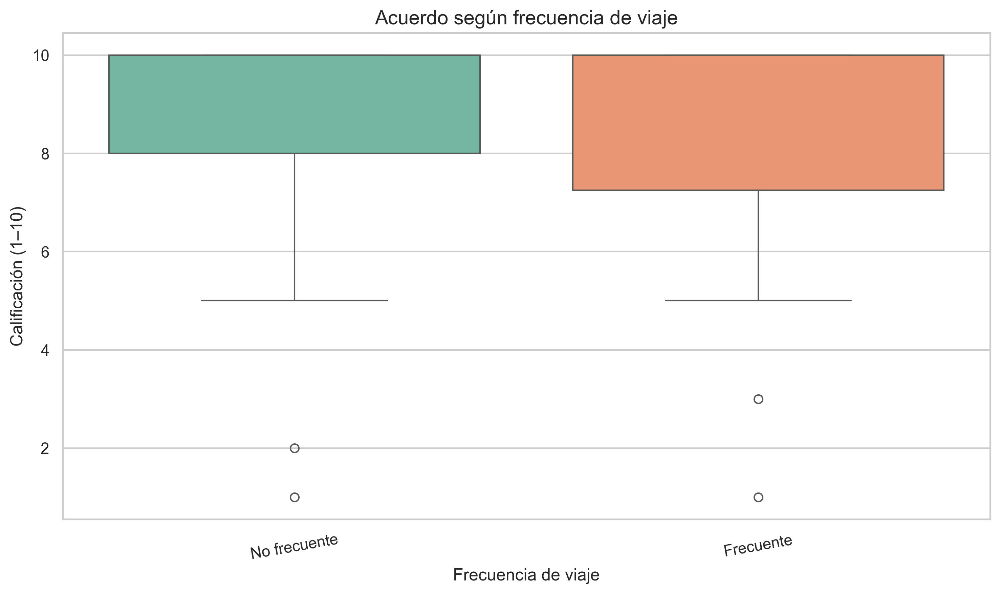
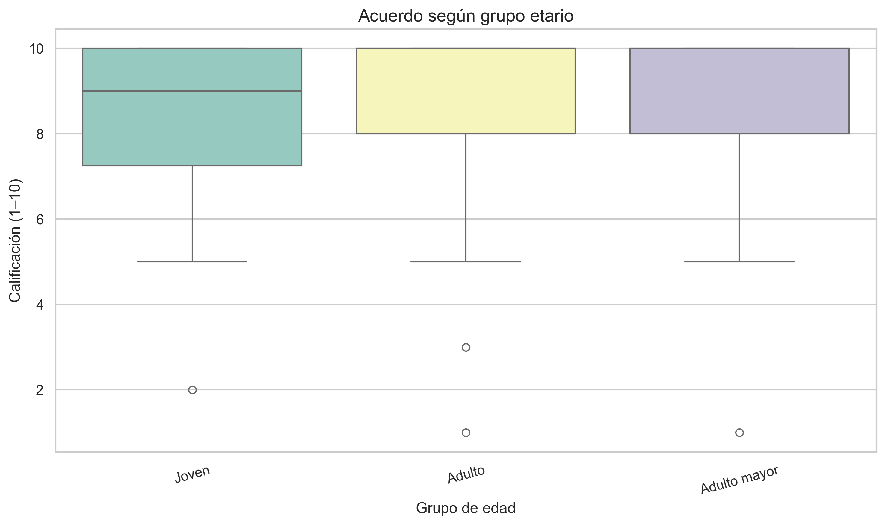
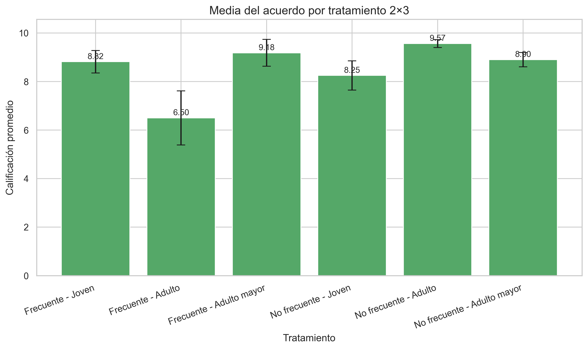

# Informe de resultados - Proyecto de Estadística

## 1. Descripción general de la muestra

- Tamaño de la muestra: 76 encuestados.
- Variables de interés:
  - Grado de acuerdo con la ampliación (1–10)
  - Percepción de impacto en la economía (1–10)
  - Percepción de necesidad de la obra (1–10)
  - Factores: frecuencia de viaje y grupo etario.

## 2. Análisis descriptivo

### 2.1. Grado de acuerdo con la ampliación

- n = 76
- Media = 8.72
- Mediana = 10.00
- Moda = 10.00
- Desviación estándar = 2.16
- Cuartiles: Q1 = 8.00, Q2 = 10.00, Q3 = 10.00

### 2.2. Impacto en la economía

- n = 76
- Media = 8.41
- Mediana = 9.00
- Moda = 10.00
- Desviación estándar = 2.11
- Cuartiles: Q1 = 7.00, Q2 = 9.00, Q3 = 10.00

### 2.3. Percepción de necesidad

- n = 76
- Media = 8.21
- Mediana = 9.00
- Moda = 10.00
- Desviación estándar = 2.26
- Cuartiles: Q1 = 7.00, Q2 = 9.00, Q3 = 10.00

## 3. Intervalos de confianza

### 3.1. Media del grado de acuerdo con la ampliación

- n = 76
- Media = 8.72
- IC 95%: [8.23, 9.22]

Con un 95 % de confianza, el verdadero promedio poblacional de acuerdo con la ampliación del aeropuerto se encuentra entre 8.23 y 9.22.

### 3.2. Proporción de personas a favor de la ampliación

- Definición de "a favor": calificación ≥ 6.
- n = 76
- Proporción muestral = 0.91
- IC 95%: [0.84, 0.97]

Con un 95 % de confianza, la proporción real de personas a favor de la ampliación se ubica entre 0.84 y 0.97.

## 4. Prueba de hipótesis principal

- Hipótesis:
  - H0: μ ≤ 5.00
  - H1: μ > 5.00
- Estadístico t = 15.04
- p-valor (cola derecha) = 0.0000
- Conclusión: Se rechaza la hipótesis nula y se concluye que la media poblacional supera a 5.00.

## 5. ANOVA factorial 2×3 (Frecuencia de viaje × Grupo etario)

```
                                       sum_sq    df         F    PR(>F)
C(frecuencia_viaje)                  6.360358   1.0  1.579370  0.213029
C(grupo_edad)                        6.262856   2.0  0.777580  0.463445
C(frecuencia_viaje):C(grupo_edad)   52.783979   2.0  6.553519  0.002461
Residual                           281.900352  70.0       NaN       NaN
```

Modelo ANOVA ajustado correctamente.

Interpretación: No se encontró evidencia significativa para el efecto principal de la frecuencia de viaje (p = 0.213). No se encontró evidencia significativa para el efecto principal del grupo etario (p = 0.463). Se encontró evidencia de que la interacción entre frecuencia de viaje y grupo etario es significativa (p = 0.002).

## 6. Gráficas









## 7. Conclusiones generales

- El grado de acuerdo con la ampliación presenta una media de 8.72, lo que sugiere una valoración favorable.
- Las percepciones sobre el impacto económico (8.41) y la necesidad de la obra (8.21) también muestran niveles altos en la escala de 1 a 10.
- La prueba t con hipótesis H0: μ ≤ 5.00 arroja p = 0.0000, lo que respalda la afirmación de que la media supera el umbral..
- No se encontró evidencia significativa para el efecto principal de la frecuencia de viaje (p = 0.213). No se encontró evidencia significativa para el efecto principal del grupo etario (p = 0.463). Se encontró evidencia de que la interacción entre frecuencia de viaje y grupo etario es significativa (p = 0.002).

